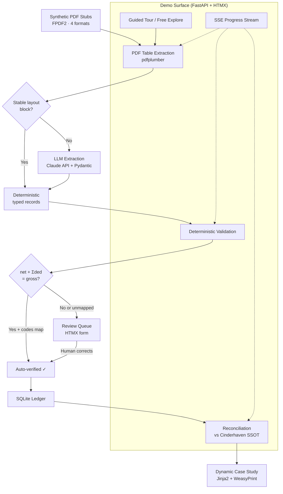

# feat: Remittance stub parsing — multi-format PDF extraction to reconciled deduction ledger

## Summary

Build a portfolio-grade pipeline that extracts deduction data from four retailer/distributor remittance PDF formats into a unified SQLite ledger, validates extractions with deterministic arithmetic checks, reconciles against the Cinderhaven SSOT, and presents the full process through an interactive FastAPI+HTMX demo with guided tour, review queue, and dynamic case study generation via WeasyPrint. Pydantic models and Jinja2 templates are shared across extraction, web, and report layers.

---

## Problem Frame

Every dollar a retailer pays a specialty food brand arrives with a remittance advice PDF listing payments and deductions. Walmart, Costco, UNFI, and KeHE each produce different formats. Today someone manually keys these into spreadsheets — weeks behind, with deductions aging past dispute windows before anyone reconciles them. The Lailara portfolio proves the practice can analyze structured data and act on deductions (Deduction Recovery, Trade Spend Leakage — both shipped). It does not yet prove the practice can get data out of documents. This piece fills that gap with the document type that compounds hardest. (See origin: `docs/brainstorms/2026-06-04-remittance-stub-parsing-requirements.md`)

---

## Requirements

Carried from origin requirements doc. R-IDs match origin.

**Synthetic stubs**
- R1. Generate synthetic stubs for Walmart, Costco, UNFI, KeHE — all native-text PDFs
- R2. Stubs reconcile against Cinderhaven SSOT ($3.7M/yr all-in trade spend, 6,563 chargebacks)
- R3. Include intentionally broken stubs (mismatched amounts, unmapped reason codes)
- R11. Reason codes correct per source (UNFI ≠ KeHE ≠ Walmart)
- R12. Realistically ugly — multi-page, inconsistent headers, messy column naming

**Extraction engine**
- R5. Parse all four formats into typed records (item, amount, reason code)
- R13. Packaged as Python module within repo, not published to PyPI

**Deterministic validation**
- R6. Arithmetic validation: `net + sum(deductions) = gross invoice`. If it balances to the penny and every reason code maps to a known category, the row is verified; otherwise routes to the review queue
- R14. Trust signal is arithmetic check — never display model confidence

**Unified ledger**
- R15. Output unified SQLite ledger with deductions classified by reason code
- R16. Reconcile against Cinderhaven invoice/AR records
- R17. Aging-vs-dispute-window view showing dollars about to expire

**Demo surface**
- R7. Both guided tour (progressive sequence) and free exploration (pick any stub)
- R8. Review queue: side-by-side PDF viewer + editable form with flagged fields
- R9. Visitor controls depth of engagement
- R18. Works for cold visitors (landing page provides context)
- R19. Equal weight: visual polish, transformation aha, process transparency

**Case study**
- R4. Dynamic case study report (HTML + PDF) reflecting explored stubs
- R10. "Show all" option for complete Cinderhaven story
- R20. Recoverable figure derived from Cinderhaven data during build
- R21. Economist voice
- R22. Lailara design system

**Deployment**
- R23. Deploy with lailarallc.com subdomain
- R24. Deployment target: Fly.io (decided during planning — see Key Technical Decisions)

**Origin actors:** A1 (CFO/controller visitor), A2 (AP clerk/ops visitor), A3 (broker visitor)
**Origin flows:** F1 (guided tour), F2 (free exploration), F3 (dynamic case study generation), F4 (review queue interaction)
**Origin acceptance examples:** AE1 (covers R6, R14), AE2 (covers R3, R6, R8), AE3 (covers R3, R6), AE4 (covers R4, R10), AE5 (covers R2, R20)

---

## Scope Boundaries

- No OCR / scanned-image pipeline
- No parsing of arbitrary/unknown PDF formats
- No automated dispute filing
- No full AP-automation workflow
- No general-purpose document parsing engine
- Extraction engine not published to PyPI
- Cloudflare Workers ruled out (WeasyPrint requires system libraries unavailable in Workers)

---

## Context & Research

### Relevant Code and Patterns

- **Cross-project:** Lailara portfolio projects use config-as-artifact (YAML), structured error contracts, deterministic validation over model confidence, Pydantic v2, self-hosted fonts (Playfair Display, Source Sans 3)
- **Dimension & Weight Integrity:** Uses Dagster + dbt + React. Different stack but same Cinderhaven SSOT anchoring pattern and deterministic synthetic data seeding
- **Item Setup Form Pre-flight:** Uses Pydantic v2 for tiered validation, YAML config per retailer — directly applicable pattern for reason-code mapping

### External References

- **pdfplumber 0.11.9:** Table extraction via layout geometry, `snap_tolerance`/`join_tolerance` tuning for messy financial PDFs, visual debugging with `debug_tablefinder()`. Handles merged cells (None-fill pattern). Known limitation: different pages may need different `table_settings`
- **Claude API structured outputs (GA 2026):** `client.messages.parse()` with Pydantic BaseModel, schema compiled into grammar that constrains token generation. Haiku 4.5 at $1/$5 per MTok — ~$2.25 for 500 documents
- **FastAPI SSE (0.135.0+):** Built-in `EventSourceResponse` with async generators, 15s keep-alive, `Last-Event-ID` reconnection. HTMX SSE extension consumes with `sse-swap` matching event names
- **WeasyPrint 69.0:** CSS Paged Media (`@page` rules, margin boxes, running headers), SVG as vectors, Flexbox/Grid support, `@font-face` for custom fonts. Requires Debian-based Docker (not Alpine) for pango/cairo
- **FPDF2 2.8.7:** Pure Python, zero system deps, canvas-based API for pixel-level control over synthetic PDF generation. Ideal for intentional error injection
- **Fly.io:** Auto-detects FastAPI, volumes for SQLite persistence, `fly scale count 1` for single-writer SQLite, custom domain via `fly certs add` + CNAME

---

## Key Technical Decisions

- **pdfplumber for PDF table extraction:** MIT license, best table detection from layout geometry for financial PDFs with inconsistent headers. Visual debugging invaluable during development. PyMuPDF is faster but AGPL-licensed (source disclosure for web apps) and weaker at table grouping. camelot-py struggles with borderless tables common in remittance stubs. (See origin: deterministic extraction for stable layout blocks)

- **Claude API with Pydantic structured outputs for LLM extraction:** Schema-guaranteed output via constrained decoding — model cannot produce tokens violating the Pydantic schema. `messages.parse()` returns typed Python objects. Haiku 4.5 is cost-effective (~$2 for 500 stubs). Benchmarks show highest financial document accuracy. (See origin: LLM extraction for variable line-item tables)

- **FastAPI + HTMX + Jinja2 for demo surface:** Native SSE for streaming pipeline progress. Pydantic models shared across extraction and API layers. No build step — ~5KB JS total. Matches the brief's rationale: side-by-side PDF viewer + editable form is snappy in HTMX where Streamlit is clunky.

- **WeasyPrint for dynamic PDF reports:** CSS Paged Media for professional print layout (page breaks, running headers/footers, page counters). SVG rendered as vectors — matches Lailara design system requirement for SVG-based charts. Jinja2 templates shared with web layer. (See origin: R4, R10)

- **FPDF2 for synthetic stub generation:** Pure Python, zero system deps. Canvas-based API gives pixel-level control over the PDF internals the parser will encounter. Intentional error injection (swapped columns, truncated amounts, misaligned rows) is straightforward. ReportLab is more powerful but unnecessarily complex for fixed-layout test data.

- **Fly.io for deployment (not Cloudflare Workers):** WeasyPrint requires pango/cairo system libraries unavailable in Cloudflare Workers/Pages. Fly.io supports custom Dockerfiles, persistent volumes for SQLite, and custom domains. `fly scale count 1` ensures single-writer SQLite integrity.

- **Reason-code mapping as YAML config:** Follows the config-as-artifact pattern from other Lailara projects (Dimension & Weight's `cost_params.yml`, Item Setup Form's partner schemas). Per-retailer YAML files are readable by practitioners and serve as a deliverable, not just implementation detail.

- **Hybrid extraction pipeline:** pdfplumber first (deterministic, fast, free) for structured table regions → Claude API second (for variable line-item tables that defeat fixed parsing). This matches the brief's architecture and minimizes LLM costs by using it only where deterministic extraction fails.

---

## Open Questions

### Resolved During Planning

- **PDF extraction library:** pdfplumber — best table detection for financial PDFs, MIT licensed, visual debugging. Research strongly supports over alternatives.
- **LLM extraction approach:** Claude API with `messages.parse()` and Pydantic models. Schema-guaranteed output eliminates malformed JSON errors.
- **Web framework:** FastAPI + HTMX + Jinja2. Native SSE, shared Pydantic models, no build step.
- **Deployment target:** Fly.io. Cloudflare Workers cannot run WeasyPrint (system library requirement).
- **Dynamic PDF generation:** WeasyPrint. CSS Paged Media, SVG vectors, shared Jinja2 templates.
- **Synthetic stub tool:** FPDF2. Pure Python, pixel-level control for error injection.

### Deferred to Implementation

- **Per-format pdfplumber settings:** Each retailer format may need different `table_settings` (snap_tolerance, strategies). Tuning happens against actual synthetic stubs during U3/U4.
- **Reason-code taxonomy:** The specific reason codes per retailer (UNFI promo codes vs KeHE codes vs Walmart codes) need domain research to get right. Build a starter set, refine during U2.
- **Recoverable dollar figure:** The specific recovery rate and dollar amount derived from the 6,563 chargebacks / ~$460K/yr recoverable base during U5.
- **Guided tour sequence:** The specific progression order (which stub first, which last) tuned during U8 based on which formats tell the most compelling story.
- **Chart library for case study visualizations:** SVG generation approach (matplotlib SVG export, inline SVG templates, or lightweight JS charting) decided during U8 based on what visualizations the case study needs.

---

## Output Structure

```
remittance-stub-parsing/
├── src/
│   ├── __init__.py
│   ├── models.py                    # Pydantic data models (shared across layers)
│   ├── config/
│   │   ├── reason_codes/
│   │   │   ├── walmart.yml
│   │   │   ├── costco.yml
│   │   │   ├── unfi.yml
│   │   │   └── keHE.yml
│   │   └── format_configs/
│   │       ├── walmart.yml
│   │       └── ...
│   ├── extraction/
│   │   ├── __init__.py
│   │   ├── pdf_extractor.py         # pdfplumber-based table extraction
│   │   ├── llm_extractor.py         # Claude API structured extraction
│   │   └── pipeline.py              # Orchestrates pdf → llm → typed records
│   ├── validation/
│   │   ├── __init__.py
│   │   ├── arithmetic.py            # net + sum(deductions) = gross check
│   │   └── reason_codes.py          # Reason-code mapping + validation
│   ├── ledger/
│   │   ├── __init__.py
│   │   ├── database.py              # SQLite ledger schema + operations
│   │   └── reconciliation.py        # Reconciliation against Cinderhaven SSOT
│   └── stub_generator/
│       ├── __init__.py
│       ├── base.py                  # Shared FPDF2 stub generation utilities
│       ├── walmart.py
│       ├── costco.py
│       ├── unfi.py
│       └── keHE.py
├── app/
│   ├── __init__.py
│   ├── main.py                      # FastAPI app entry point
│   ├── routes/
│   │   ├── demo.py                  # Demo routes (upload, process, explore)
│   │   ├── review.py                # Review queue routes
│   │   ├── report.py                # Case study generation routes
│   │   └── tour.py                  # Guided tour routes + SSE
│   ├── templates/
│   │   ├── base.html
│   │   ├── index.html               # Landing page
│   │   ├── partials/                # HTMX partial templates
│   │   └── report/                  # Case study report templates (HTML + PDF)
│   └── static/
│       ├── css/
│       ├── fonts/                   # Self-hosted Playfair Display, Source Sans 3
│       └── js/
├── stubs/                           # Generated synthetic stubs (output of U2)
├── data/                            # Cinderhaven reference data (queries/exports)
├── tests/
│   ├── test_extraction.py
│   ├── test_llm_extraction.py
│   ├── test_validation.py
│   ├── test_ledger.py
│   ├── test_stub_generator.py
│   ├── test_routes.py
│   └── test_review.py
├── Dockerfile
├── fly.toml
├── pyproject.toml
└── requirements.txt
```

---

## High-Level Technical Design

> *This illustrates the intended approach and is directional guidance for review, not implementation specification. The implementing agent should treat it as context, not code to reproduce.*



**Shared layers:**
- Pydantic models (`src/models.py`) used by: extraction engine, validation, FastAPI routes, Claude API structured output
- Jinja2 templates (`app/templates/`) used by: FastAPI web views, WeasyPrint PDF reports
- Reason-code YAML configs (`src/config/reason_codes/`) used by: validation layer, stub generator, case study narrative

---

## Implementation Units

### U1. Foundation — project setup, data models, configs

**Goal:** Establish the Python project structure, shared Pydantic data models, and reason-code configuration that all other units depend on.

**Requirements:** R2, R5, R11, R13

**Dependencies:** None

**Files:**
- Create: `pyproject.toml`
- Create: `requirements.txt`
- Create: `src/__init__.py`
- Create: `src/models.py`
- Create: `src/config/reason_codes/walmart.yml`
- Create: `src/config/reason_codes/costco.yml`
- Create: `src/config/reason_codes/unfi.yml`
- Create: `src/config/reason_codes/keHE.yml`
- Test: `tests/test_models.py`

**Approach:**
- Define Pydantic models for: `RemittanceStub` (header-level), `DeductionEntry` (line-item), `ReasonCode` (code + category + description), `ValidationResult` (pass/fail + details), `ReconciliationResult` (matched/unmatched + amounts)
- Reason-code YAML files per retailer with code → category mapping. Start with a reasonable set per retailer; refine during stub generation
- `pyproject.toml` with dependencies: pdfplumber, anthropic, fastapi, uvicorn, jinja2, weasyprint, fpdf2, pydantic, python-multipart, aiosqlite

**Patterns to follow:**
- Config-as-artifact pattern from Lailara projects (YAML files readable by practitioners)
- Pydantic v2 with strict mode for financial amounts

**Test scenarios:**
- Happy path: Pydantic models accept valid financial data (amounts, dates, reason codes)
- Edge case: DeductionEntry with zero amount is valid (some deductions are informational)
- Edge case: Reason code not in YAML config is flagged as unmapped
- Error path: Invalid date format rejected by Pydantic validation
- Error path: Negative gross invoice amount rejected

**Verification:**
- All Pydantic models importable from `src.models`
- Reason-code YAML files load and parse correctly for all 4 retailers
- `pip install -e .` succeeds
- pytest passes

---

### U2. Synthetic stub generation — FPDF2 stubs for 4 formats

**Goal:** Generate realistic remittance stub PDFs for Walmart, Costco, UNFI, and KeHE using FPDF2, including intentionally broken stubs that will exercise the validation and review queue.

**Requirements:** R1, R2, R3, R11, R12

**Dependencies:** U1

**Files:**
- Create: `src/stub_generator/__init__.py`
- Create: `src/stub_generator/base.py`
- Create: `src/stub_generator/walmart.py`
- Create: `src/stub_generator/costco.py`
- Create: `src/stub_generator/unfi.py`
- Create: `src/stub_generator/keHE.py`
- Create: `stubs/` (output directory for generated PDFs)
- Test: `tests/test_stub_generator.py`

**Approach:**
- Each retailer gets a generator class that produces PDFs matching that retailer's typical remittance format (header layout, column naming, line-item structure)
- Use FPDF2's canvas API for direct placement of text, tables, and lines
- Per-retailer variation: different column names for the same concepts (e.g., "Deduction Amount" vs "Adjustment" vs "Allowance"), different header layouts, different reason-code formats
- Broken stubs: at least one per format category — amounts that don't balance, reason codes not in the mapping table, truncated line items, extra whitespace in descriptions
- All stubs must tie back to Cinderhaven SSOT data — query invoice/AR records from Postgres and generate stubs that reference real invoice numbers and amounts
- Deterministic seeding for reproducible outputs

**Execution note:** Build one format end-to-end first (Walmart — simplest layout), verify the extraction engine can parse it (U3), then build the remaining three.

**Patterns to follow:**
- Deterministic synthetic data seeding (matching Dimension & Weight pattern)
- FPDF2 table construction via cell placement

**Test scenarios:**
- Happy path: Generated Walmart stub is a valid PDF with extractable text
- Happy path: Generated stub line items sum correctly (for clean stubs)
- Covers AE5. Generated stubs' totals reconcile to Cinderhaven canonical figures
- Edge case: Multi-page stub (UNFI with many line items) generates correctly across page boundaries
- Edge case: Broken stub has intentionally mismatched amounts (net + deductions ≠ gross)
- Edge case: Broken stub has a reason code not present in the YAML config
- Integration: pdfplumber can open and extract text from each generated stub

**Verification:**
- 4+ clean stubs and 2+ broken stubs exist in `stubs/`
- Each stub opens in a PDF viewer and looks like a realistic remittance advice
- pdfplumber can extract tables from each stub
- Clean stub amounts balance; broken stub amounts do not

---

### U3. PDF table extraction — pdfplumber with per-format tuning

**Goal:** Extract structured table data from remittance stub PDFs using pdfplumber, with per-format configuration to handle each retailer's layout idiosyncrasies.

**Requirements:** R5, R13

**Dependencies:** U1, U2

**Files:**
- Create: `src/extraction/__init__.py`
- Create: `src/extraction/pdf_extractor.py`
- Create: `src/config/format_configs/walmart.yml`
- Create: `src/config/format_configs/costco.yml`
- Create: `src/config/format_configs/unfi.yml`
- Create: `src/config/format_configs/keHE.yml`
- Test: `tests/test_extraction.py`

**Approach:**
- Per-format YAML config specifying pdfplumber `table_settings` (vertical/horizontal strategy, snap_tolerance, join_tolerance) and column mapping (which column index maps to which field)
- Extractor class that: loads format config → opens PDF with pdfplumber → extracts tables per page → maps columns to standard fields → returns raw extracted data (not yet validated)
- Header extraction: separate from table extraction — parse the header region for check number, payment date, total payment amount, payer name
- Handle merged cells (None-fill pattern) and multi-page tables
- Visual debugging output during development using `debug_tablefinder()`

**Patterns to follow:**
- pdfplumber `page.extract_tables(table_settings=settings)` with per-format tuned settings
- `page.crop()` for isolating header vs table regions

**Test scenarios:**
- Happy path: Walmart stub extracts all line items with correct amounts and reason codes
- Happy path: UNFI stub with different column naming extracts correctly via column mapping
- Happy path: Header fields (check number, payment date, total) extracted from each format
- Edge case: Multi-page KeHE stub extracts tables across page boundaries
- Edge case: Stub with inconsistent column spacing still extracts via tolerance tuning
- Edge case: Stub with merged header cells handles None-fill correctly
- Error path: Corrupted or empty PDF raises a clear extraction error (not a crash)

**Verification:**
- All 4 format stubs extract cleanly with correct field mapping
- Extracted amounts match the values in the generated stubs (round-trip validation)

---

### U4. LLM structured extraction — Claude API for variable line items

**Goal:** Use Claude API with Pydantic structured outputs to parse variable-format line-item tables that pdfplumber's deterministic extraction cannot reliably handle.

**Requirements:** R5, R14

**Dependencies:** U1, U3

**Files:**
- Create: `src/extraction/llm_extractor.py`
- Create: `src/extraction/pipeline.py`
- Modify: `src/extraction/__init__.py`
- Test: `tests/test_llm_extraction.py`

**Approach:**
- `llm_extractor.py`: Takes raw extracted text from pdfplumber and sends it to Claude API with `messages.parse()` using the `DeductionEntry` Pydantic model. Returns typed records
- `pipeline.py`: Orchestrates the full extraction flow — pdfplumber first for stable blocks (header, structured tables), Claude API for variable line-item sections that pdfplumber's table detection handles poorly
- Use Claude Haiku 4.5 for cost efficiency (~$2 for 500 documents)
- System prompt: financial document parser context, ISO 8601 dates, USD amounts
- Prompt caching for the system prompt across multiple stubs
- Fallback: if Claude API is unavailable (no API key, rate limited), the pipeline still returns pdfplumber-only results with a flag indicating LLM extraction was skipped

**Patterns to follow:**
- Anthropic SDK `client.messages.parse(output_format=PydanticModel)`
- Check `stop_reason` before accessing `parsed_output`

**Test scenarios:**
- Happy path: Claude API returns correctly typed DeductionEntry records matching stub data
- Happy path: Pipeline falls back to pdfplumber-only when no API key is configured
- Edge case: Stub with abbreviated reason code descriptions — Claude normalizes them
- Edge case: Stub with extra whitespace and inconsistent formatting — Claude handles gracefully
- Error path: Claude API rate limit — pipeline returns partial results with error flag
- Error path: Claude returns truncated output (max_tokens hit) — pipeline detects and flags
- Integration: Full pipeline (pdfplumber → Claude → typed records) produces correct output for all 4 formats

**Verification:**
- Pipeline produces typed `DeductionEntry` records for each format
- LLM-extracted amounts match stub values exactly (no hallucinated numbers)
- Pipeline works with and without Claude API key

---

### U5. Validation, ledger, and reconciliation

**Goal:** Implement the deterministic validation layer (arithmetic check + reason-code mapping), build the SQLite ledger, and reconcile against Cinderhaven SSOT data. Derive the recoverable dollar figure.

**Requirements:** R6, R14, R15, R16, R17, R20

**Dependencies:** U1, U4

**Files:**
- Create: `src/validation/__init__.py`
- Create: `src/validation/arithmetic.py`
- Create: `src/validation/reason_codes.py`
- Create: `src/ledger/__init__.py`
- Create: `src/ledger/database.py`
- Create: `src/ledger/reconciliation.py`
- Create: `data/` (Cinderhaven reference data exports)
- Test: `tests/test_validation.py`
- Test: `tests/test_ledger.py`

**Approach:**
- **Arithmetic validation:** For each stub, check `net_cash + sum(deduction_amounts) == gross_invoice` to the penny. If it balances, mark as arithmetic-verified. If not, route to review queue with the discrepancy amount
- **Reason-code validation:** Check each deduction's reason code against the retailer's YAML config. If mapped, tag with category. If unmapped, route to review queue regardless of arithmetic result
- **SQLite ledger:** Schema with tables for stubs (header-level), deductions (line-level), validation_results, and reconciliation_results. WAL mode for read concurrency
- **Reconciliation:** Match parsed deductions against Cinderhaven invoice/AR records (exported from Postgres as reference data). Flag matched vs unmatched, compute net reconciled amounts
- **Aging analysis:** Calculate days remaining in dispute window per deduction. Flag deductions approaching or past the window
- **Recoverable figure:** Derive from the reconciled data — sum of invalid/disputable deductions that are still within the dispute window, anchored against the ~$460K/yr operational deduction waste

**Patterns to follow:**
- Structured error contracts (validation returns typed results, not booleans)
- aiosqlite for async SQLite access from FastAPI

**Test scenarios:**
- Covers AE1. Clean stub with balancing amounts and mapped codes → auto-verified, no confidence score shown
- Covers AE2. Stub with mismatched amounts → routes to review with discrepancy details
- Covers AE3. Stub with unmapped reason code → routes to review even if arithmetic balances
- Happy path: Reconciliation matches deductions to Cinderhaven invoices correctly
- Happy path: Aging analysis correctly flags deductions near dispute window expiry
- Covers AE5. Ledger totals tie exactly to Cinderhaven canonical $3.7M/yr all-in trade spend
- Edge case: Deduction with zero amount passes validation (informational entry)
- Edge case: Multiple deductions on one stub — some valid, some invalid — mixed result
- Error path: Cinderhaven reference data missing for an invoice → unmatched flag, not crash
- Integration: Full flow from typed records → validation → ledger → reconciliation produces correct SQLite output

**Verification:**
- SQLite ledger populated with all stub data
- Validation correctly separates clean from broken stubs
- Reconciled totals match Cinderhaven canonical figures
- Dispute-window aging calculations are correct

---

### U6. FastAPI web app — skeleton, templates, HTMX, SSE

**Goal:** Build the FastAPI web application skeleton with Jinja2 templates, HTMX integration, SSE for pipeline progress streaming, and the landing page.

**Requirements:** R7, R9, R18, R19, R22

**Dependencies:** U1, U5

**Files:**
- Create: `app/__init__.py`
- Create: `app/main.py`
- Create: `app/routes/__init__.py`
- Create: `app/routes/demo.py`
- Create: `app/routes/tour.py`
- Create: `app/templates/base.html`
- Create: `app/templates/index.html`
- Create: `app/templates/partials/` (HTMX partial templates)
- Create: `app/static/css/main.css`
- Create: `app/static/fonts/` (Playfair Display, Source Sans 3 woff2)
- Create: `app/static/js/` (minimal JS for PDF viewer)
- Test: `tests/test_routes.py`

**Approach:**
- FastAPI app with Jinja2 templates and static file serving
- Base template with Lailara design system tokens (Canvas background, typography scale, Chicago accent)
- Landing page that explains the tool for cold visitors (A1, A2, A3 personas)
- HTMX setup: partials directory for swappable fragments, `hx-swap` patterns for step-by-step reveals
- SSE endpoint using FastAPI's built-in `EventSourceResponse` for streaming pipeline progress (extraction started → tables found → validation running → results ready)
- Stub picker: endpoint that lists available stubs with format metadata
- Process endpoint: accepts a stub selection, runs the pipeline, streams progress via SSE, returns results as HTMX partial swaps
- Health check endpoint for Fly.io

**Patterns to follow:**
- FastAPI + Jinja2 template rendering with `hx-request` header detection for partial vs full-page responses
- HTMX SSE extension with `sse-swap` matching event names
- Lailara design system CSS tokens

**Test scenarios:**
- Happy path: Landing page renders with correct typography and design tokens
- Happy path: Stub picker lists all available stubs with format labels
- Happy path: Processing a stub streams SSE events and returns results
- Happy path: HTMX partial response returned when `hx-request` header present
- Edge case: Full page response returned for non-HTMX requests (direct URL access)
- Error path: Processing a nonexistent stub returns appropriate error fragment
- Integration: Full flow from stub selection → SSE progress → results display works in browser

**Verification:**
- App starts with `uvicorn app.main:app`
- Landing page renders in browser with Lailara design system styling
- Pipeline progress streams via SSE
- HTMX swaps update the page without full reload

---

### U7. Interactive demo — guided tour, free exploration, review queue

**Goal:** Build the guided tour (F1), free exploration (F2), and review queue (F4) experiences that make the demo both educational and interactive.

**Requirements:** R7, R8, R9, R19

**Dependencies:** U6

**Files:**
- Create: `app/routes/review.py`
- Create: `app/templates/tour.html`
- Create: `app/templates/explore.html`
- Create: `app/templates/review.html`
- Create: `app/templates/partials/step_result.html`
- Create: `app/templates/partials/review_form.html`
- Create: `app/templates/partials/pdf_viewer.html`
- Modify: `app/templates/index.html` (add tour/explore entry points)
- Test: `tests/test_review.py`

**Approach:**
- **Guided tour (F1):** Progressive sequence through all 4 formats. Each step reveals the next pipeline stage (raw PDF → extracted fields → validation result → reconciled entry). Simpler stubs first, building to the broken stub that fails validation and routes to the review queue. SSE drives the reveal animation
- **Free exploration (F2):** Stub picker grid — visitor clicks any of the 4 formats, runs it through the pipeline independently. Each result card shows extraction + validation + reconciliation for that stub
- **Review queue (F4):** Side-by-side layout — PDF rendered in an iframe on the left, editable form on the right with flagged fields highlighted (red border, tooltip explaining why). Form edits submit via `hx-post` and re-run validation. When the form balances, the row transitions from flagged to verified
- **Adaptive depth (R9):** Visitor can expand/collapse process detail at each step. Default shows the result; click to reveal the intermediate steps

**Patterns to follow:**
- HTMX `hx-swap="beforeend"` for progressive step reveals in guided tour
- HTMX `hx-trigger="sse:stepComplete"` for SSE-driven transitions
- PDF.js or `<iframe>` for PDF rendering (decide during implementation)

**Test scenarios:**
- Covers F1. Guided tour progresses through all 4 formats in sequence
- Covers F2. Free exploration allows selecting any stub independently
- Covers F4 / AE2. Broken stub routes to review queue with flagged fields highlighted
- Happy path: Editing a flagged field and resubmitting re-runs validation
- Happy path: Correcting a mismatched amount transitions the row from flagged to verified
- Edge case: Visitor switches from guided tour to free exploration mid-tour
- Edge case: Review queue handles a stub with multiple flagged fields
- Error path: Editing a field to an invalid value shows inline validation error

**Verification:**
- Guided tour walks through all 4 formats with SSE-driven reveals
- Free exploration allows picking any stub
- Review queue shows side-by-side PDF + editable form
- Correcting a flagged field re-validates and transitions to verified

---

### U8. Dynamic case study — report generation with WeasyPrint

**Goal:** Generate a dynamic case study report (HTML in-app, downloadable as PDF via WeasyPrint) that reflects the stubs the visitor explored, with a "show all" option for the complete Cinderhaven story.

**Requirements:** R4, R10, R20, R21, R22

**Dependencies:** U5, U7

**Files:**
- Create: `app/routes/report.py`
- Create: `app/templates/report/case_study.html` (shared template for HTML + PDF)
- Create: `app/templates/report/sections/` (modular report sections)
- Modify: `app/templates/base.html` (print styles)
- Test: `tests/test_report.py`

**Approach:**
- **Dynamic content:** Report includes only the stubs the visitor explored — reconciliation findings, deduction classification, aging vs dispute window for those specific stubs. Data pulled from the SQLite ledger
- **"Show all" toggle:** Switches to the complete Cinderhaven story across all 4 formats. Same template, different data scope
- **HTML view:** Rendered in-app using the same Jinja2 template system, with Lailara design system styling
- **PDF download:** Same Jinja2 template rendered through WeasyPrint with `@page` rules for letter size, 0.6in margins, running footer (Lailara LLC brand + page counter), self-hosted fonts
- **Report sections:** Hook (the PDF pile), proof (unified ledger + classifications), evidence (validation loop), margin math (recovery, labor, forfeit). Each section is a Jinja2 partial for modularity
- **Economist voice:** Sober, declarative, data-forward narrative generated around the actual numbers. No marketing language
- **Charts:** Inline SVG charts for deduction breakdown, aging analysis, recovery potential. SVG renders as vectors in WeasyPrint

**Patterns to follow:**
- WeasyPrint `HTML(string=html, base_url=static_dir).write_pdf()` with CSS stylesheet
- CSS `@page` rules for print layout
- Lailara design system chart rules (horizontal gridlines only, text labels on every data point)

**Test scenarios:**
- Covers AE4. Report for 2 explored stubs shows only those formats; "show all" adds the rest
- Happy path: HTML report renders in browser with correct styling
- Happy path: PDF download produces a valid PDF with correct page breaks and running footer
- Happy path: Charts render as SVG vectors in the PDF
- Edge case: Report with only one stub explored still produces a coherent narrative
- Edge case: "Show all" report handles both clean and broken stubs in the narrative
- Error path: WeasyPrint font loading failure falls back gracefully (system fonts)
- Integration: Fonts (Playfair Display, Source Sans 3) render correctly in both HTML and PDF

**Verification:**
- Dynamic report reflects only the explored stubs
- "Show all" shows the complete story
- PDF opens correctly with proper print layout
- All numbers tie to Cinderhaven canonical figures

---

### U9. Design system polish and Fly.io deployment

**Goal:** Apply final Lailara design system polish across all views and deploy to Fly.io with a lailarallc.com subdomain.

**Requirements:** R19, R22, R23, R24

**Dependencies:** U8

**Files:**
- Create: `Dockerfile`
- Create: `fly.toml`
- Create: `.dockerignore`
- Modify: `app/static/css/main.css` (final design system pass)
- Modify: `app/templates/base.html` (final responsive/mobile pass)
- Modify: all templates (final visual polish pass)

**Approach:**
- **Design system audit:** Walk through every view and verify Lailara design system compliance — Canvas background (#f5f3ee), typography scale, Chicago accent (#1f2e7a), Hong Kong teal sequential for data, semantic status colors for validation states (Pass=HK-95, Fail=red surface), dark callout cards for key findings
- **Responsive pass:** Mobile breakpoint at 640px per design system. Ensure the demo is usable on tablet (controller forwarding to CFO on iPad)
- **Dockerfile:** `python:3.13-slim` base, WeasyPrint system deps (pango, cairo, fontconfig), custom fonts, requirements install, uvicorn CMD
- **fly.toml:** Region iad, port 8080, health check on `/health`, volume mount for SQLite at `/data`, `auto_stop_machines = "stop"`, `min_machines_running = 0`
- **Deployment:** `fly launch`, volume creation, `fly scale count 1` for SQLite, `fly certs add` for custom domain, CNAME at DNS provider
- **Secrets:** `ANTHROPIC_API_KEY` via `fly secrets set`

**Test expectation: none** — this unit is deployment configuration and visual polish, not behavioral code. Verification is visual inspection and deployment success.

**Verification:**
- All views match Lailara design system tokens (spot-check colors, fonts, chart rules)
- App deploys to Fly.io and is accessible at the custom domain
- Health check passes
- SQLite persists across deploys (volume mount)
- Custom fonts render correctly in deployed environment
- WeasyPrint PDF generation works in deployed environment

---

## System-Wide Impact

- **Interaction graph:** FastAPI routes → extraction pipeline → validation → SQLite ledger → report generator. SSE streams cross the pipeline→web boundary. Review queue form submissions re-enter validation
- **Error propagation:** Extraction failures surface as HTMX error fragments (not 500 pages). Validation failures route to review queue (by design, not by error). Claude API failures fall back to pdfplumber-only with a visible flag
- **State lifecycle risks:** SQLite WAL mode for read concurrency during SSE streaming. Single-writer constraint enforced by `fly scale count 1`. Generated stubs are static files (no state). Session state for "which stubs has this visitor explored" stored server-side (in-memory or SQLite)
- **API surface parity:** No external API consumers — this is a demo application. Internal API is FastAPI routes consumed by HTMX
- **Integration coverage:** The critical cross-layer scenario is the full pipeline: stub upload → extraction → validation → ledger → reconciliation → report. This must be tested end-to-end, not just per-unit
- **Unchanged invariants:** Cinderhaven SSOT figures ($3.7M/yr all-in trade spend, 6,563 chargebacks) are read-only inputs — this project never writes to the SSOT

---

## Risks & Dependencies

| Risk | Mitigation |
|------|------------|
| pdfplumber settings need per-page tuning for complex stubs | Build synthetic stubs with known structure; tune settings against them. Visual debugging (`debug_tablefinder()`) surfaces detection issues early |
| Claude API costs accumulate during development | Use Haiku 4.5 (cheapest). Cache system prompts. During dev, mock the API with saved responses for formats already working |
| WeasyPrint CSS edge cases in grid/flexbox page breaks | Use simple layouts in reports. Test PDF generation early (U8). Avoid CSS Grid inside page-breaking sections |
| Reason codes incorrect for a retailer format | Research real-world reason codes per retailer during U2. Start with a reasonable set; flag as "modeled" in the case study |
| SQLite single-writer bottleneck under concurrent demo visitors | Acceptable for portfolio demo traffic. WAL mode handles concurrent reads. If needed, queue writes via async task |
| Cinderhaven SSOT access (Postgres) | Export reference data to static files during development. No runtime dependency on Postgres in the demo app |
| Self-hosted fonts fail to load in WeasyPrint Docker | Use .ttf files (most reliable). Include `fc-cache -fv` in Dockerfile. Test font rendering during U9 |

---

## Documentation / Operational Notes

- README.md to be updated with: what the project does, how to run locally, how to generate stubs, how to deploy
- Case study narrative written during U8 — Economist voice, anchored to Cinderhaven numbers
- Fly.io deployment documented in README (fly launch, volume, secrets, custom domain)

---

## Sources & References

- **Origin document:** [docs/brainstorms/2026-06-04-remittance-stub-parsing-requirements.md](docs/brainstorms/2026-06-04-remittance-stub-parsing-requirements.md)
- **pdfplumber:** https://github.com/jsvine/pdfplumber (MIT, v0.11.9)
- **Claude API structured outputs:** https://platform.claude.com/docs/en/build-with-claude/structured-outputs
- **FastAPI SSE:** https://fastapi.tiangolo.com/tutorial/server-sent-events/
- **HTMX SSE extension:** https://htmx.org/extensions/sse/
- **WeasyPrint:** https://doc.courtbouillon.org/weasyprint/stable/ (v69.0)
- **FPDF2:** https://py-pdf.github.io/fpdf2/ (v2.8.7)
- **Fly.io FastAPI:** https://fly.io/docs/python/frameworks/fastapi/
- **Lailara design system:** `~/projects/published/lailara-design-system/LAILARA_DESIGN_SYSTEM.md`
